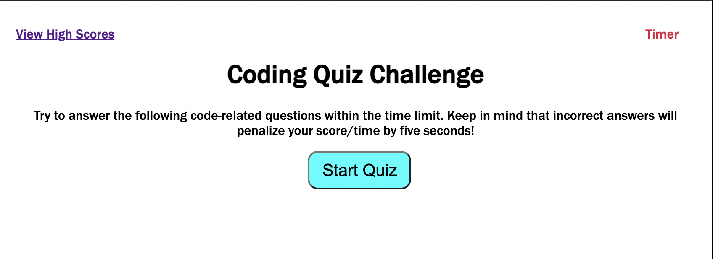

# Code Quiz Challenge 

## Description

A website about a questions on a code, relatively a quiz. The person has to click on the start button to start the quiz. As the questions are presented, the timer starts. If answer correctly then you move to the next question but if answered wrong then the time is reduced by five seconds. When the timer reaches 0 or when all the answers are given, the game is over. After the game is over, the person can check the scores of how many they got correct. 

---

## Built With
* HTML
* CSS variables
* Java Script
* Array
* MediaQuery

---

## Screenshot

---

## Website
[Code Quiz Challenge](https://sonipoud.github.io/QAMPLY/)

---

## Contribution
Made with love by Sonika Poudyal 

